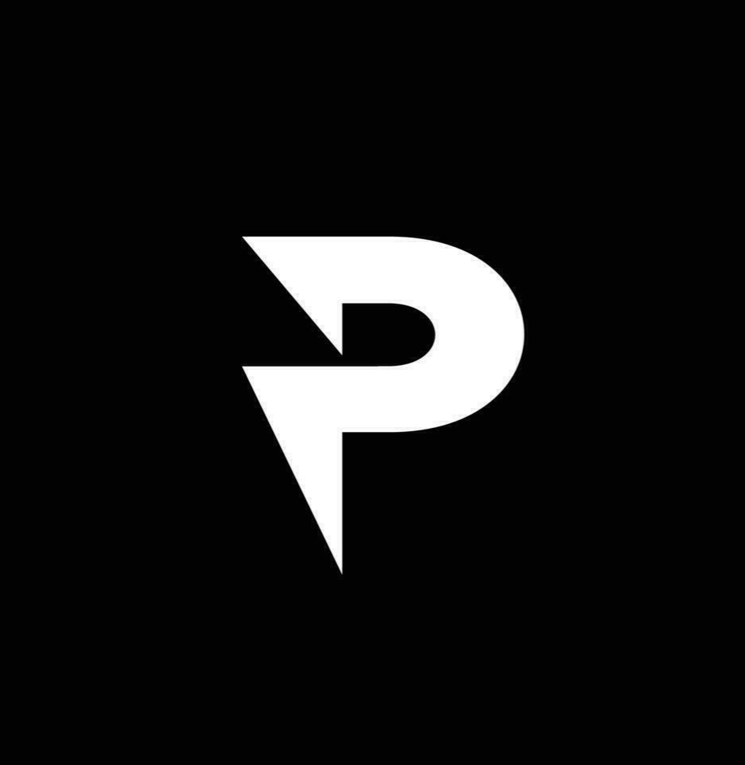

# ✦ Pushkar Chhokar — GenAI Developer Portfolio

<div align="center">
  
  
  <h3><strong>Creating RAG Applications That Feel Alive.</strong></h3>
  <p align="center">
    A premium, high-performance interactive developer portfolio showcasing generative AI products, LLM integrations, retrieval pipelines, and interactive 3D elements.
  </p>

  [](https://vitejs.dev/)
  [](https://react.dev/)
  [](https://tailwindcss.com/)
  [](https://threejs.org/)
</div>

---

## 🚀 Key Features

*   **Interactive 3D ID Card (`BandCard`):** A physical card rendering built using React Three Fiber (R3F) and `@react-three/rapier` physics simulation. Users can grab, pull, and swing the card, with elegant canvas textures representing front and back sides.
*   **Tech Stack Dome Sphere:** A 3D orbital sphere visualization of technical capabilities that rotates dynamically based on mouse drag or swipe inputs.
*   **Fully Responsive Experience:** Optimized fluid typography, margin/padding clamps, and layout reflow protections ensuring consistency from massive monitors to small smartphones (e.g. iPhone SE).
*   **Typing Welcome Interface:** Aesthetic loading screen with micro-animations and loading completion indicators matched to unmounting routines.
*   **Offline Resume Generator:** Implemented using `html2pdf.js` to dynamically render and download a clean, structured PDF resume directly from the browser.

---

## 🛠️ Tech Stack & Dependencies

### Frontend & Core
- **Framework:** React 19 + TypeScript (Vite bundler)
- **Styling:** TailwindCSS v4 + Custom OKLCH Colors (Glassmorphic details, premium dark theme)
- **Routing:** React Router DOM v7

### 3D Graphics & Physics
- **Three.js Core:** `three`
- **React Bindings:** `@react-three/fiber`
- **Utility Helpers:** `@react-three/drei`
- **Physics Engine:** `@react-three/rapier` (Rope, ball, and cuboid joints)
- **Dynamic Renderers:** `meshline` (Ribbon rendering)

### Animations & Transitions
- **Framer Motion:** High-fidelity micro-interactions, exit/entry page states

---

## ⚡ Performance Optimizations (Under the hood)

To achieve **ultra-smooth 60 FPS** performance on both PC and mobile devices:

1.  **Transform-based rendering (GPU Acceleration):** Replaced layout-triggering `left`/`top` CSS styles in the Tech Stack Dome Sphere with GPU-accelerated `translate3d(x, y, z)` transforms, avoiding layout recalculations (reflows) on every animation frame.
2.  **Intersection Observer Throttling:** The Dome Sphere's `requestAnimationFrame` animation loop automatically pauses when scrolled out of view, consuming 0% idle CPU power.
3.  **Adaptive Physics Sleeping:** Rigid bodies in the R3F simulation are configured to enter sleep mode when idle. Stabilization math is skipped until the user triggers a hover or drag, preventing background CPU overhead.
4.  **Capped Device Pixel Ratio (DPR):** Adjusted the WebGL Canvas DPR limit to `1.5` on desktop and `1.0` on mobile. Added `powerPreference: "high-performance"` WebGL flags to request dedicated GPUs.
5.  **Optimized Animation Timings:** Synchronized the Welcome Screen progress bar duration (`4.8s`) with the timeout state (`5.0s`) to prevent sudden unmounts.

---

## 🔧 Installation & Local Setup

Prerequisites: Make sure you have [Node.js](https://nodejs.org/) installed.

1.  **Clone the Repository:**
    ```bash
    git clone https://github.com/pushkarsingh26/pushkarsingh.git
    cd pushkarsingh
    ```

2.  **Install Dependencies:**
    ```bash
    npm install
    ```

3.  **Run Development Server:**
    ```bash
    npm run dev
    ```
    Open `http://localhost:8080` in your browser.

4.  **Production Build:**
    ```bash
    npm run build
    ```

---

## 👤 Developer Profile

- **Full Name:** Pushkar Chhokar
- **Personal Email:** [pushkarcd123@gmail.com](mailto:pushkarcd123@gmail.com)
- **GitHub:** [@pushkarsingh26](https://github.com/pushkarsingh26)
- **LinkedIn:** [Pushkar Chhokar](https://www.linkedin.com/in/pushkar-chhokar)
- **Live:** [Pushkar's Portfolio](https://pushkarsingh-26.vercel.app/)
